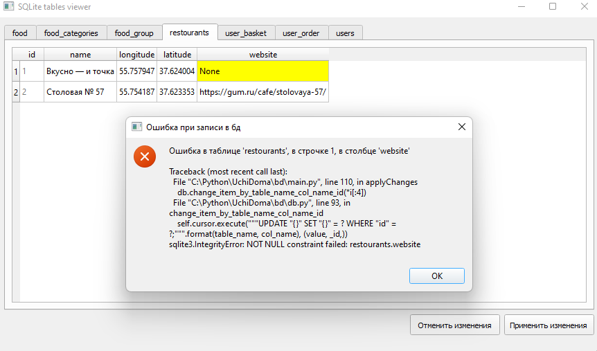

# db
[DrawSQL diagram](https://drawsql.app/teams/grigoriys-team/diagrams/uchi-doma)

#### Если в ячейке написать "None", то это значение будет преобразованно в NULL в бд (и если при записи в бд будет ошибка типа: "sqlite3.IntegrityError: NOT NULL constraint failed", то она будет выведена на экран пользователю (как мессадж бокс)):

